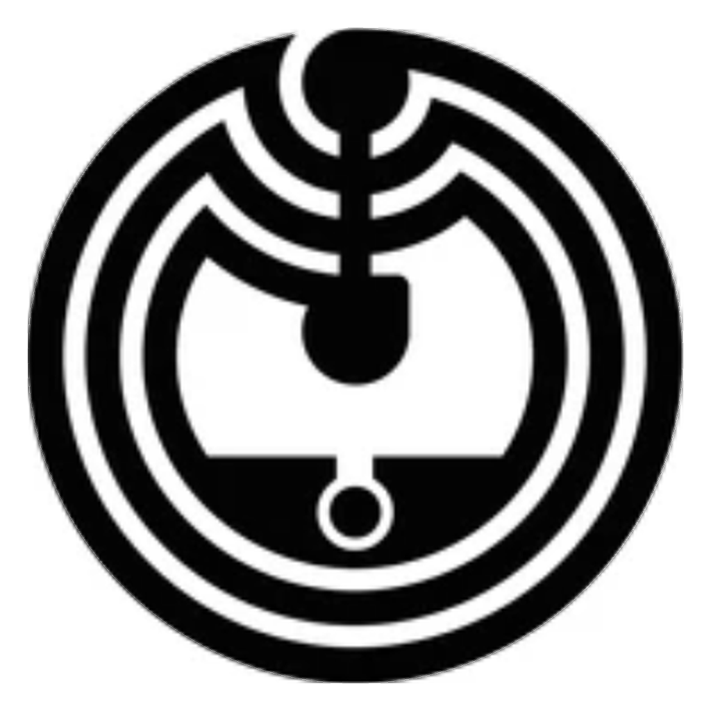

<p align="center">
  
</p>

<h1 align="center">lazyTrigger</h1>

lazyTrigger turns the things you do over and over on your computer into a
single tap. You put a small tag (a key fob, card or sticker) on a little
USB device next to your keyboard, and it carries out whatever you set that
tag to do: unlock your computer, lock it when you walk away, press a
keyboard shortcut, type a piece of text, open a website, or show a
reminder. Each tag can have its own action, or a short list of them, and
you can change them at any time from a web page, with no programming.

Some examples:

- Tap your key fob to unlock the computer; take it away to lock it.
- Tap a card to switch your window layout, and tap again for the next one.
- Tap a sticker to type your email signature or open your daily dashboard.

It works on Windows, macOS and Linux. To your computer the device looks
like an ordinary keyboard, so it needs no drivers.

## Getting started

### 1. Get the device

You need the device itself: a Raspberry Pi Pico board with an RFID reader
wired to it, plus a few tags. The parts cost a few dollars and connect with
seven wires, no soldering required. See [Hardware](#hardware) for the parts
list and wiring.

### 2. Download the lazyTrigger app

Go to the [latest release](https://github.com/SalomeSulkhanishvili/LazyTrigger/releases/latest)
and download the file for your computer:

| Computer | File |
|---|---|
| Mac with Apple Silicon (M1 or newer) | `lazyTrigger-macOS-AppleSilicon.zip` |
| Mac with an Intel processor | `lazyTrigger-macOS-Intel.zip` |
| Windows | `lazyTrigger-Windows.exe` |
| Linux | `lazyTrigger-Linux` |

Nothing else needs installing.

#### Opening it the first time

The app isn't signed by Apple or Microsoft (that needs a paid developer
account), so the first time you open it your computer blocks it and asks
you to confirm that you trust it. You only do this once.

**macOS** shows *"Apple could not verify "lazyTrigger" is free of malware
that may harm your Mac or compromise your privacy."* To allow it:

1. Unzip the download and drag **lazyTrigger** into your **Applications**
   folder.
2. Open it. When the warning appears, click **Done** (not "Move to Trash").
3. Open **System Settings → Privacy & Security** and scroll down to the
   **Security** section.
4. Next to *"lazyTrigger" was blocked to protect your Mac*, click
   **Open Anyway**, then confirm with **Open Anyway** and your password or
   Touch ID.

From then on it opens like any other app.

**Windows** shows *"Windows protected your PC"*. Move
`lazyTrigger-Windows.exe` somewhere it can stay, such as your Documents
folder, open it, and click **More info → Run anyway**.

**Linux:** allow the file to run (right-click → **Properties →
Permissions → Allow executing file as program**, or
`chmod +x lazyTrigger-Linux`), then open it.

**Rather not change security settings?** Download the source code instead
(**Source code (zip)** on the same release page) and run lazyTrigger from the
terminal with `make`. It does exactly the same, and nothing asks for
permission. See [Setting up from the terminal instead](#setting-up-from-the-terminal-instead).

### 3. Open it and set up the device

Opening lazyTrigger opens its page in your web browser. The **Setup**
section at the top does the rest:

- **A brand-new Pico** needs its software installed once. Hold the Pico's
  **BOOTSEL** button while plugging it in, choose your board in the page
  and click **Install lazyTrigger on this Pico**. This takes about a
  minute and needs an internet connection. When it says it's done, unplug
  the Pico and plug it back in.
- **A device that's already set up** shows as connected straight away.

### 4. Set up your tags

For each tag:

1. Build the list of actions you want (see
   [What a tag can do](#what-a-tag-can-do)).
2. Click **Tap a tag to attach it now** and hold the tag on the reader.

To unlock your computer with a tag, first set your login password in the
page and tap the tag you want to use for unlocking (see
[How Unlock behaves](#how-unlock-behaves)).

Your tags and actions are saved on the device itself, so they keep working
after it is unplugged or moved to another computer.

### 5. Everyday use

Keyboard actions (shortcuts, lock, typing text or saved secrets) work as
soon as the device is plugged in, with nothing running on the computer.
Unlock, reminders and opening links need lazyTrigger running in the
background, so open the app when you plug in the device.

To skip that, tick **Start lazyTrigger when I log in** in the Setup
section: at each login it checks once whether the device is plugged in and
starts lazyTrigger in the background if it is. Nothing keeps running when
it isn't.

lazyTrigger stops by itself once the device is unplugged and its page is
closed, or click **Quit lazyTrigger** in the page. Opening the app again
brings the page back whenever you want to change your tags.

**Updating:** download the new version the same way, open it, and click
**Update device software** in the Setup section. Your tags, actions and
settings are kept.

### Setting up from the terminal instead

If you'd rather use the source code: download this project (**Source code
(zip)** on the [latest release](https://github.com/SalomeSulkhanishvili/LazyTrigger/releases/latest),
**Code → Download ZIP** on GitHub, or `git clone`) and unzip it, install **Python 3.8 or newer**
(https://www.python.org/downloads/), open a terminal in the project folder
and run:

```sh
make
```

This prepares the helper program, installs the software on a new Pico (hold
**BOOTSEL** while plugging it in first) and starts the helper if the Pico is
plugged in. It is safe to run again. Then open **http://127.0.0.1:8787**,
which has the same Setup section as the app.

- **Windows:** `make` works from Command Prompt without installing anything
  else; in PowerShell type `.\make`.
- **Pico W / Pico 2 W** boards need their own build:
  `make BOARD=raspberry_pi_pico_w` (or `raspberry_pi_pico2_w`).

Whenever you plug in the Pico, run `make start`. It starts the helper (the
"bridge") in the background with no window, and it stops by itself about 10
seconds after the Pico is unplugged.

| Command | What it does |
|---|---|
| `make` | set up everything (safe to re-run) |
| `make start` | start the bridge in the background (after plugging in the Pico) |
| `make stop` | stop the bridge now |
| `make autostart` | optional: at each login, check once for the Pico and start the bridge if it's plugged in |
| `make autostart-remove` | turn that login check off |
| `make status` | is the bridge running, and is the Pico connected? |
| `make logs` | follow the bridge's log |
| `make upload` | push firmware changes to the Pico (`FILES="code.py"`, `PORT=...` optional) |
| `make bridge` | run the bridge in the terminal instead of the background |
| `make app` | build the double-click app for this computer (see [Building the app](#building-the-app)) |
| `make help` | every command |

## What a tag can do

In the configurator you can:

- Set the shared unlock password (write-only; encrypted to your tag), or
  **Reset password** to forget it without touching tags, actions or secrets
- Choose the **keyboard layout** your computer uses: English (US), German
  (Mac), German (Windows / Linux) or Georgian (QWERTY). It has to match the
  computer's input source (on a Mac, the one in the menu bar), not what is
  printed on the keys. Typed text then comes out as written, and shortcuts
  like Cmd+Z stay on the right key. With Georgian, Latin letters can't be
  typed, since the Georgian input source turns their keys into Georgian
  ones
- Save named secrets that a tag can type (passwords, codes)
- Choose whether a tag's taps run the whole list or cycle one at a time
- Build each tag's `on_tap` and `on_remove` lists from these actions:
  - **Unlock**: wake the screen and type the password (per-OS wake key and
    delay)
  - **Lock**: the screen-lock shortcut, defaulting to a universal form that
    works without telling it which OS it is plugged into
  - **Keyboard shortcut**: any chord you pick from modifiers + a key
  - **Type text**: a literal snippet, optionally followed by Enter
  - **Type a saved secret**: an encrypted value, entered inline
  - **Open a link**: opens a URL in your default browser (needs the bridge)
  - **Reminder**: a notification like "It's been 1479 days since ..." or a
    countdown to a date (needs the bridge)
  - **Wait**: a pause, for sequences only

  One tag can combine them. For example **Unlock → Wait 2s → Open a link →
  Wait 3s → Type a saved secret** unlocks the computer, opens a login page
  and types the password for it. Save the secret by tapping that same tag.
  The secret can be typed after the tag is lifted, because the key it read
  moments before is reused for that one tap's actions.
- Reorder, test, or remove individual actions
- Tap-to-add a tag to the whitelist with the actions you just built
- Edit an existing tag's actions, or rename/remove it, at any time
- Adjust how long a tag must be absent before its `on_remove` action runs
- Read/write raw data on a tag (advanced): one 16-byte block at a time, or
  **read all** 64 blocks in one tap (block 5, the encryption key, is never
  read there). After reading all, **Copy to another tag** writes the data
  blocks to a second tag and checks them. Each tag's ID, the encryption key
  and the tags' own access keys are never copied
- Clear the device log, or switch on **Debug** to also see routine
  `{"ok": true}` replies (off by default, when the device doesn't send
  them at all; the choice is saved on the device)
- Factory reset the device (erases tags, actions, the password and secrets)

### How Unlock behaves

- Only the tag you tap while **setting the password** can unlock: the
  password is encrypted with a key written onto that tag. Another tag with
  an Unlock action does nothing (it doesn't even press Enter, so it never
  causes a failed login attempt), and the configurator shows why.
- It first wakes the screen with a key chosen per OS: **Shift** on macOS
  and Linux, and on Windows (and "Universal") **Space** followed by
  **Backspace**, because Shift doesn't lift the Windows lock screen and the
  Backspace removes the space if the password box was already open. Enter
  is never used to wake, since on an open box it would submit an empty
  password.
- It types only when the bridge reports the screen is locked, so the
  password can't land in whatever window has focus. Without the bridge
  running, Unlock does nothing.
- It types through the **Keyboard layout** chosen in Global settings. Pick
  the one your login screen uses: with the wrong one, some keys produce
  different characters and the password comes out wrong.

### Switching window layouts

The Pico can only send USB keystrokes, it can't itself move windows around
or know what "developer layout 2" means. To use it for things like
switching window layouts, bind the shortcuts you configure per tag (e.g.
`Ctrl+Alt+1`, `Ctrl+Alt+2`, ...) to actions in a window-management tool
running on your computer: PowerToys FancyZones or a virtual-desktop hotkey
on Windows, Rectangle/yabai/Hammerspoon on macOS, or your window manager's
own keybindings on Linux (i3, GNOME, etc). The tag just fires the hotkey;
the layout logic lives in that tool.

## How it works

The rest of this README is for people building the device, changing the
firmware or curious about the details.

**The firmware has no hardcoded notion of your OS, "lock", "unlock", or any
specific shortcut.** It only knows how to play back a small set of generic
actions (press a key chord, type text, wait, or type the stored password).
Every decision about *what* a tag should do, which shortcut, which layout,
in what order, is made in the browser configurator and sent to the device
as plain data. Nothing computer-specific ever lives in code.

The Pico enumerates over USB as two things at once:

- **A USB keyboard (HID).** Each whitelisted tag has its own list of
  actions to run when tapped (`on_tap`) and its own list to run when taken
  away (`on_remove`). Each tag chooses how its `on_tap` list is read:
  - **Sequence** (default), every action runs, in order, on each tap.
    "Unlock, wait a second, then open my dashboard."
  - **Cycle**: one action per tap, advancing and wrapping, so a single tag
    steps through several shortcuts on repeated taps (1, 2, 3, 1, 2, 3...),
    e.g, rotating window layouts.

  `on_remove` always runs in full. This is why the `wait` action is only
  offered for sequences: in a cycle it would consume a whole tap doing
  nothing visible.
- **A second USB serial port (CDC "data" channel).** A local web page
  ([configurator/index.html](configurator/index.html)) talks to this port
  using the Web Serial API (Chrome/Edge) to read and change every tag's
  actions live, no reflashing needed.

Configuration (tags, their actions, and the shared unlock password) is
stored in `config.json` on the Pico's flash and survives power cycles.

Tags are matched by their UID. MFRC522 also supports reading and writing a
small amount of extra data onto MIFARE Classic tags themselves (16-byte
blocks), the configurator's "Advanced" panel and the pairing option "also
write label onto tag" use this to optionally store a label on the tag
itself, in addition to the whitelist stored on the device. See
[PROTOCOL.md](PROTOCOL.md) for the full serial API and action schema.

## Hardware

- Raspberry Pi Pico or Pico 2 (RP2040/RP2350; the "W" wireless variants also
  work but aren't required, no network connectivity is used)
- MFRC522 RFID reader module (13.56 MHz, SPI)
- Breadboard + jumper wires (or a soldered perfboard build)
- MIFARE Classic tags/cards/fobs (13.56 MHz)

### Wiring

Seven jumper wires, no other components.

| MFRC522 pin | Pico GPIO | Pico physical pin |
|---|---|---|
| 3.3V | 3V3(OUT) | 36 |
| RST | GP20 | 26 |
| GND | GND | 23 |
| IRQ | not connected | |
| MISO | GP16 | 21 |
| MOSI | GP19 | 25 |
| SCK | GP18 | 24 |
| SDA (CS) | GP17 | 22 |

Hold the board with the USB port at the top. Every wire goes to the
right-hand edge, counting up from the bottom right corner:

```
pin 36  3V3(OUT)  ->  3.3V
pin 28  GND           (a ground; either this or pin 23 works)
pin 26  GP20      ->  RST
pin 25  GP19      ->  MOSI
pin 24  GP18      ->  SCK
pin 23  GND       ->  GND
pin 22  GP17      ->  SDA (CS)
pin 21  GP16      ->  MISO
```

Three things to get right:

1. Power from `3V3(OUT)` on pin 36. The pin next to it, `3V3_EN` on pin 37,
   switches the Pico's regulator off when pulled low. It is not a power
   source.
2. Never power the reader from VBUS or 5V. Its logic pins drive straight
   into the Pico's GPIOs, which are 3.3V only.
3. `SDA` on the reader is chip select in SPI mode, despite the silkscreen.
   It goes to GP17.

The right-hand edge is not a continuous run of GPIOs: pin 23 is a ground
sitting between GP17 and GP18. Counting pins without allowing for it puts
every wire above it one position out, so count from the bottom-right corner
(pin 21, GP16) and skip pin 23.

Leave the reader's IRQ pin unconnected. The firmware doesn't use it:
CircuitPython has no GPIO interrupt mechanism, so watching that line would
just mean polling a different pin, and the firmware polls the reader
directly instead.

### Checking the wiring

If tags are not detected, read the reader's version register. This proves
the SPI link without involving a card:

```python
import board, busio, digitalio
spi = busio.SPI(board.GP18, MOSI=board.GP19, MISO=board.GP16)
cs = digitalio.DigitalInOut(board.GP17)
cs.direction = digitalio.Direction.OUTPUT; cs.value = True
spi.try_lock(); spi.configure(baudrate=1000000)
cs.value = False
spi.write(bytes([((0x37 << 1) & 0x7E) | 0x80]))
b = bytearray(1); spi.readinto(b); cs.value = True; spi.unlock()
print(hex(b[0]))
```

`0x91` or `0x92` (genuine NXP chip) or `0x82`, `0x88`, `0x12`, `0xB2`
(common clones) means the reader is wired correctly. `0x00` or `0xff` means
the Pico gets no answer at all: check that MISO and MOSI are not swapped,
that SDA is on GP17, and that no wire landed on a ground pin instead of its
GPIO.

### If tags are not read reliably

The firmware checks the reader every 2 seconds and re-initialises it if it
stopped answering, so a wire that was loose and is pushed back in recovers
without a reboot. If the reader answers but tags are missed:

- **Try another tag.** Tags vary a lot: one tag that answered 1 time in 100
  read 39 times out of 40 when swapped for another, on the same reader and
  firmware. Reading the UID needs one short exchange; setting a password or
  reading tag memory needs several in a row, so a weak tag fails those
  first.
- **Hold the tag flat on the centre of the antenna coil**, away from metal
  and jumper wires.
- **Solder the headers** on the reader and the Pico. Pins that are only
  pushed through carry SPI but give an unstable supply under the radio's
  load. A 10 µF plus a 100 nF capacitor across 3.3V/GND at the reader helps
  too.

## Customising for your build

The repository holds no personal data: your tags, actions, password and
secrets live only on your Pico and are edited in the configurator. What
differs between builds is set in two places:

**[firmware/settings.toml](firmware/settings.toml)**: the reader's pins
(wired differently? change `RFID_SCK`, `RFID_MOSI`, `RFID_MISO`, `RFID_CS`,
`RFID_RST`), how often it checks for a tag, the pairing timeout and how long
a tag's key stays cached. Every value is commented and defaults to the
wiring above. After editing it, run `make upload` to copy it to the Pico.
A setting that isn't a valid pin or number stops the firmware with a
message saying which line is wrong (visible in the Pico's serial console).

**`LAZYTRIGGER_BRIDGE_PORT`**: the bridge's web port, 8787 by default. If
something else on your computer uses 8787, set it when starting the
bridge: `LAZYTRIGGER_BRIDGE_PORT=8790 make start` (macOS/Linux) or
`set LAZYTRIGGER_BRIDGE_PORT=8790` then `make start` (Windows). Open the
configurator from the bridge's own address (`http://127.0.0.1:8790`) in
that case; the page opened as a file expects 8787.

## Firmware setup by hand

The app's Setup section and `make` do all of this for you; these are the
same steps done by hand.

This project uses **CircuitPython**, not MicroPython or the C SDK, because
it needs a composite USB HID + CDC device and a writable filesystem for
runtime config. CircuitPython supports both out of the box.

1. Install CircuitPython on the Pico: hold the **BOOTSEL** button while
   plugging it in, then copy the appropriate `.uf2` from
   https://circuitpython.org/board/raspberry_pi_pico/ (or
   `raspberry_pi_pico2` for a Pico 2) onto the `RPI-RP2` drive that appears.
   The board reboots as a `CIRCUITPY` drive.
2. Download the CircuitPython Library Bundle matching your CircuitPython
   version from https://circuitpython.org/libraries, and copy these into
   `CIRCUITPY/lib/`:
   - `adafruit_hid/` (folder)
3. Copy this repo's `firmware/` contents onto the `CIRCUITPY` drive:
   - `settings.toml` (edit it first if your wiring differs, see
     [Customising for your build](#customising-for-your-build))
   - `boot.py`
   - `code.py`
   - `config.py`
   - `protocol.py`
   - `secretbox.py`
   - `mfrc522.py`
   - `keyboard_layout_win_de.py`, `keyboard_layout_mac_de.py` and `keyboard_layout_ka.py`
   (`lib/adafruit_hid` from step 2 should already be there alongside them.)

   Once `boot.py` has run the drive is read-only to your computer, so use
   `make upload` for later updates (see below).
4. The Pico will reboot. On first boot it creates a default `config.json`
   with an empty password and no tags, open the configurator to set it up.

Because `boot.py` remounts the filesystem read-write for the microcontroller
(needed so it can save config changes), the `CIRCUITPY` drive appears
**read-only** to your computer afterwards. That's expected, you configure
the device over the serial port, not by editing files on the drive.

To update firmware files later, run `make upload` (or
`make upload FILES="code.py mfrc522.py"` for specific files). It writes them
over the REPL in small confirmed pieces, decodes each file completely
before replacing the old one, so an interrupted or garbled transfer leaves
the previous file intact, checks the size and checksum the Pico reports,
and soft-reloads. Your configuration is kept.

## Connecting the configurator

There are two ways to reach the configurator, depending on your browser:

**Chrome, Edge, or Brave (no install needed):** open
[configurator/index.html](configurator/index.html) directly (just
double-click it), click **Connect via Web Serial**, and pick the Pico's
*data* serial port from the browser's picker (it's the second of the two
ports the Pico exposes, if you pick the wrong one, just reconnect and try
the other). This uses the [Web Serial API](https://developer.mozilla.org/en-US/docs/Web/API/Web_Serial_API),
which only Chromium-based browsers implement.

**Safari, Firefox, or any other browser:** these have no Web Serial support
(Apple/WebKit has stated it won't add it to Safari), so use the small local
bridge instead: the lazyTrigger app, `make start` (background) or
`make bridge` (in the terminal). It auto-detects the Pico (by actually pinging each USB serial
port, not by guessing which one), reconnects by itself after the Pico
resets, and serves the configurator: open `http://127.0.0.1:8787` in any
browser. Served by the bridge, the page connects to the device by itself
and adds the Setup section. Run from source, the bridge needs Python 3 on
the computer (`make` installs its one dependency, `pyserial`, into
`.venv`); the app bundles its own. The device itself needs no drivers on
any OS.

The bridge is also what shows reminders, opens links and reports whether
the screen is locked, so run it (`make start`) whenever you use those
actions, whether or not the configurator page is open.

## Building the app

The app is the bridge packaged with
[PyInstaller](https://pyinstaller.org) together with its own Python, the
configurator page and the firmware files.
[app/lazytrigger_app.py](app/lazytrigger_app.py) is what runs when it is
opened: it starts the bridge in the background if it isn't running and
opens the page. The Setup section's buttons are carried out by the bridge
(`/app/...` in [bridge/serial_bridge.py](bridge/serial_bridge.py)), using
the same steps as `make` ([bridge/device_setup.py](bridge/device_setup.py)).

To build it for the computer you're on:

```sh
make app
```

The result is in `dist/`. PyInstaller can only build for the system it
runs on, so releases are built by GitHub Actions
([.github/workflows/release.yml](.github/workflows/release.yml)) on macOS
(Apple Silicon and Intel), Windows and Linux. To publish a release, push a
version tag:

```sh
git tag v1.0.0
git push origin v1.0.0
```

The workflow builds all four files and attaches them to a new release on
the repository's Releases page. To try a change without releasing, run the
workflow from the **Actions** tab; the builds are then under that run's
artifacts.

## Security notes

- The unlock password and saved secrets are AES-128-CBC encrypted with a
  key stored **on the RFID tag**, never on the Pico. A dump of the Pico's
  flash yields ciphertext without a key; a cloned tag yields a key with no
  ciphertext. Both are needed, which costs nothing since the tag has to be
  on the reader anyway.
- These values are **write-only**: `get_config` strips them, so nothing on
  the serial port can read them back. They cannot be hashed, the device
  must reproduce the exact characters to type them, and hashing is
  one-way. Changing the password requires proving you know the current one,
  checked against a salted PBKDF2 value (600,000 rounds) computed in the
  configurator, so guessing the password from a flash dump is slow.
  **Reset password** forgets it without that proof, which is safe: it
  reveals nothing, and setting a new one needs a tag tap.
- The tag key sits in block 5 of the tag. "Read all" never reads it; a
  single-block read of block 5 does show it, so avoid that on a shared
  screen.
- Never commit the Pico's `config.json`: it holds the encrypted password,
  secrets and the check value. `.gitignore` excludes it.
- Lose or reformat the tag and the password must be set again. There is
  deliberately no recovery path.
- MIFARE Classic tags can be copied: the firmware uses the factory sector
  key, so a phone app reads the tag key in seconds, and the tag's
  encryption (Crypto-1) is broken anyway. A copied tag works on **your**
  Pico like the original. Keep the unlock tag with you, like a house key.
  This device is aimed at convenience (not leaving your desk unlocked, not
  needing to retype a password constantly), not as a substitute for full
  disk encryption or a security boundary against a determined attacker.
  Tags that can't be copied (NTAG 424 DNA, MIFARE DESFire) would need new
  firmware support.
- The Web Serial configurator only works over a direct USB connection. The
  bridge listens only on `127.0.0.1`, so nothing on the network can reach
  it, but it currently accepts device commands from any page open in your
  browser on this computer. Stop it (**Quit lazyTrigger**, or `make stop`)
  when you don't need it. The Setup section's actions (installing software,
  changing the login item, quitting) are refused unless they come from
  lazyTrigger's own page.

## Repo layout

```
firmware/
  settings.toml # your build's pins and timings (edit, then `make upload`)
  boot.py       # USB device setup, runs once at power-on
  code.py       # main loop: RFID polling, HID actions, serial protocol
  protocol.py   # canonical action/command/event constants
  config.py     # config.json load/save helpers
  secretbox.py  # AES encryption of password/secrets with the tag-held key
  mfrc522.py    # MFRC522 SPI driver (UID read, block read/write)
  keyboard_layout_win_de.py  # German layout (from Neradoc's Circuitpython_Keyboard_Layouts, MIT)
  keyboard_layout_mac_de.py  # German layout for macOS, built on the one above
  keyboard_layout_ka.py      # Georgian (QWERTY) layout
configurator/
  index.html    # browser-based configurator (Web Serial or the local bridge)
bridge/
  serial_bridge.py    # local HTTP/SSE<->serial bridge; also shows reminder popups
  device_setup.py     # install/autostart steps shared by `make` and the app
  upload_firmware.py  # pushes firmware over the REPL (drive is read-only)
app/
  lazytrigger_app.py  # what runs when the app is opened
  icon.png            # the app's icon
  requirements.txt    # what building the app needs
tools/
  manage.py           # setup/start/upload/autostart for every OS (what `make` runs)
  build_app.py        # packages the app with PyInstaller (`make app`)
  check_protocol.py   # fails if protocol.py and protocol.js drift apart
.github/workflows/
  release.yml   # builds the app for every OS and publishes releases
Makefile        # `make` entry point; forwards to tools/manage.py
make.cmd        # the same `make` commands on Windows without GNU make
PROTOCOL.md     # serial JSON protocol reference
```
